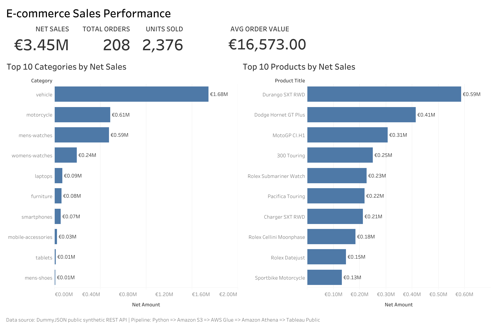
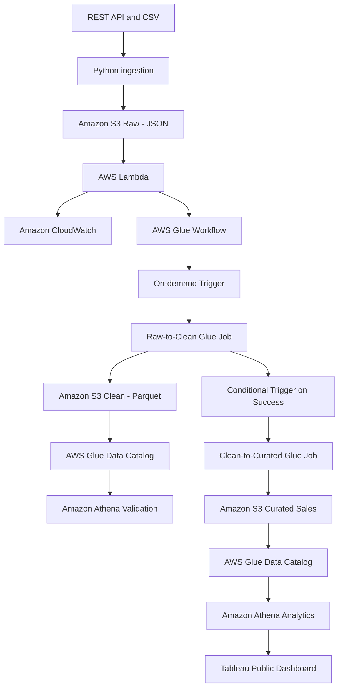

# AWS E-Commerce Data Platform

[](https://github.com/semiramishg/aws-ecommerce-data-platform/actions/workflows/tests.yml)
[](https://github.com/semiramishg/aws-ecommerce-data-platform/actions/workflows/terraform.yml)

An end-to-end AWS data engineering project that ingests synthetic e-commerce data, processes it through raw, clean, and curated data layers, and makes it available for serverless analytics, and presents business insights through an interactive Tableau Public dashboard.

## Analytics Dashboard

The curated Athena dataset is visualized in an interactive Tableau Public dashboard featuring:

- Net sales, total orders, units sold, and average order value KPIs
- Top 10 product categories by net sales
- Top 10 products by net sales
- Interactive category-to-product filtering

Dashboard KPIs

|KPI                |Result    |
|-------------------|---------:|
|Net Sales          |€3.45M    |
|Total Orders       |208       |
|Units Sold         |2,376     |
|Average Order Value|€16,573.00|

Average order value is calculated as:

```text
SUM(Net Amount) / COUNTD(Order ID)
```

Live Dashboard

[View the interactive dashboard on Tableau Public](https://public.tableau.com/views/E-commerceSalesPerformanceDashboard_17890509045910/E-commerceSalesDashboard)

[](https://public.tableau.com/views/E-commerceSalesPerformanceDashboard_17890509045910/E-commerceSalesDashboard)

The Tableau-ready dataset contains 788 analytical rows and 14 non-sensitive fields. Customer names and email addresses were intentionally excluded before publication.

> Data source: Public synthetic e-commerce data from the DummyJSON REST API. The cloud data pipeline and infrastructure were implemented end-to-end on AWS.


## Architecture



## Data Layers

|Layer    |Format             |Purpose                                                                                 |
|---------|-------------------|----------------------------------------------------------------------------------------|
|Raw      |JSON               |Preserves the original ingested API and CSV data                                        |
|Clean    |Parquet            |Stores validated and standardized customers, orders, and products                       |
|Curated  |Partitioned Parquet|Provides an analytics-ready sales dataset enriched with customer and product information|
|BI Export|CSV                |Provides a non-sensitive Tableau-ready analytical dataset                               |

The curated sales dataset is partitioned by `ingestion_date` to reduce the amount of data scanned by analytical queries.

## Implemented Workflow

The pipeline is automated with AWS Glue Workflow and event-driven Lambda orchestration:

1. Ingest synthetic customer, order, and product data using Python.
2. Upload the source data to the Amazon S3 raw layer.
3. Process S3 events with AWS Lambda and record monitoring information in CloudWatch.
4. Start the AWS Glue Workflow automatically from Lambda.
5. Run the raw-to-clean Glue job through an on-demand workflow trigger.
6. Start the clean-to-curated Glue job only after the raw-to-clean job succeeds.
7. Transform raw JSON data into clean Parquet datasets using AWS Glue and PySpark.
8. Discover clean datasets with AWS Glue Crawlers and validate them using Amazon Athena.
9. Join orders, customers, and products into a curated sales dataset.
10. Write partitioned Parquet files to the S3 curated layer.
11. Register the curated dataset in the AWS Glue Data Catalog.
12. Run analytical SQL queries using Amazon Athena.
13. Export a non-sensitive Tableau-ready dataset from the Athena results.
14. Build KPI and ranking visualizations in Tableau Public.
15. Publish the interactive dashboard to Tableau Public.

## Analytics Results

The completed pipeline produced:

- 788 curated sales line items
- 208 distinct orders
- 2,376 units sold
- 24 product categories
- Total net revenue of 3,447,183.80
- Average order value of €16,573.00
- No duplicate order-product combinations in the validated curated dataset

Example business analyses include:

- Revenue and units sold by product category
- Top products by net revenue
- Top customers by revenue
- Validation of record counts and financial totals
- Interactive exploration of top categories and products

## Tableau Dataset

The Tableau export contains the following analytical fields:

|Field                |Description                      |
|---------------------|---------------------------------|
|`order_id`           |Order identifier                 |
|`customer_id`        |Non-sensitive customer identifier|
|`product_id`         |Product identifier               |
|`product_title`      |Product name                     |
|`category`           |Product category                 |
|`quantity`           |Number of units purchased        |
|`unit_price`         |Price per unit                   |
|`gross_amount`       |Sales amount before discount     |
|`discount_percentage`|Applied discount percentage      |
|`net_amount`         |Sales amount after discount      |
|`order_gross_amount` |Gross amount at order level      |
|`order_net_amount`   |Net amount at order level        |
|`ingested_at`        |Ingestion timestamp              |
|`ingestion_date`     |Ingestion date                   |

The published dataset excludes customer names and email addresses.

## Technology Stack

- Python
- PySpark
- SQL
- Amazon S3
- AWS Lambda
- AWS Glue ETL
- AWS Glue Workflow
- AWS Glue Crawlers
- AWS Glue Data Catalog
- Amazon Athena
- Amazon CloudWatch
- AWS CLI
- Git and GitHub
- Terraform
- GitHub Actions
- Tableau Public
- pytest

## Project Structure

```text
.
├── .github/
│ └── workflows/
│ ├── terraform.yml
│ └── tests.yml
├── architecture/
│ └── decisions/
├── bootstrap/
│ └── main.tf
├── data/
│ └── sample/
| └── tableau/
|    └── ecommerce_sales_tableau.csv/
├── docs/
| └── images/
│    └── ecommerce-sales-dashboard.png
├── infrastructure/
│ ├── crawlers.tf
│ ├── glue.tf
│ ├── iam.tf
│ ├── jobs.tf
│ ├── lambda.tf
│ ├── lambda_iam.tf
│ ├── lambda_trigger.tf
│ ├── monitoring.tf
| |── orchestration.tf
│ ├── providers.tf
│ ├── s3.tf
│ ├── variables.tf
│ └── versions.tf
├── sql/
│ └── athena/
│       ├── 01_validate_clean_counts.sql
│       ├── 02_top_customers_by_revenue.sql
│       ├── 03_validate_curated_sales.sql
│       ├── 04_revenue_by_category.sql
│       └── 05_top_products_by_revenue.sql
├── src/
│ ├── glue/
│ ├── ingestion/
│ │   └── extract_api.py
│ ├── lambda/
│ ├── utils/
│ └── run_pipeline.py
├── tests/
├── .env.example
├── ecommerce_sales_dashboard.twbx
├── pytest.ini
├── requirements.txt
└── README.md
```

## Infrastructure as Code

Terraform manages the AWS resources used by the data platform, including:

- Amazon S3 data-lake configuration
- AWS Glue databases, crawlers, jobs, IAM roles, and policies
- AWS Lambda function, IAM resources, and S3 event notification
- Amazon CloudWatch log-group configuration

A separate `bootstrap` Terraform configuration creates the remote-state S3 bucket. The backend uses:

- Amazon S3 server-side encryption
- S3 versioning
- S3 native state locking
- Public-access blocking
- `prevent_destroy` protection for critical resources

Existing AWS resources were imported into Terraform and reconciled until both Terraform configurations returned `No changes`.

GitHub Actions automatically runs `terraform fmt`, backend-free initialization, and `terraform validate` for both `bootstrap` and `infrastructure`.

## SQL Analytics

Athena queries are stored in `sql/athena/`:

- `01_validate_clean_counts.sql`
- `02_top_customers_by_revenue.sql`
- `03_validate_curated_sales.sql`
- `04_revenue_by_category.sql`
- `05_top_products_by_revenue.sql`

These queries validate the clean and curated layers and produce business analytics used for the final Tableau dashboard.

## Automated Tests

The project includes an automated Python test suite configured with pytest.
Current local test resulted `5 passed` with `pytest -q`.

GitHub Actions runs the tests automatically for repository changes.

## Reliability, Security, and Cost Controls

The project uses:

- Parquet columnar storage
- Date-based partitioning
- Data-quality validation
- Conditional Glue Workflow execution
- CloudWatch logging
- Minimal Glue worker capacity
- Short Glue job timeouts
- On-demand Glue Crawlers
- Athena queries that scan only small Parquet datasets
- Environment variables for configuration
- Terraform-managed infrastructure
- Encrypted and versioned remote Terraform state
- CI validation for Python and Terraform
- No credentials or secrets committed to Git
- No real customer data
- No customer names or email addresses in the public BI dataset

## Project Status

The core end-to-end data platform and BI solution are complete:

- [x] Data ingestion
- [x] S3 raw layer
- [x] Lambda monitoring
- [x] Raw-to-clean Glue transformation
- [x] Clean Glue Data Catalog
- [x] Athena clean-data validation
- [x] Clean-to-curated Glue transformation
- [x] Curated Glue Data Catalog
- [x] Athena business analytics
- [x] Automated orchestration
- [x] Infrastructure as Code
- [x] Secure remote Terraform state
- [x] Terraform CI validation
- [x] BI dashboard
- [x] Tableau Public publication
- [x] Automated tests

## Key Learning Outcomes

This project demonstrates practical experience with:

- Designing an end-to-end AWS cloud data platform
- Building an event-driven ingestion workflow
- Orchestrating dependent AWS Glue jobs
- Transforming nested JSON data with PySpark
- Implementing raw, clean, and curated data layers
- Using partitioned Parquet for analytical storage
- Cataloging cloud datasets
- Querying S3 data with Amazon Athena
- Managing AWS infrastructure with Terraform
- Importing existing AWS resources into Terraform state
- Configuring secure remote Terraform state
- Implementing CI validation with GitHub Actions
- Writing and running automated tests
- Building an interactive Tableau dashboard
- Publishing privacy-safe analytical data
- Documenting an end-to-end data engineering solution

## Potential Enhancements

The core project is complete. Possible future extensions include:

- Scheduled ingestion with Amazon EventBridge
- Automated data-quality alerts and failure notifications
- Incremental processing for larger datasets
- Additional ingestion dates for time-series analysis
- Dashboard filters for ingestion date and customer segment
- Cost and performance monitoring for larger workloads
