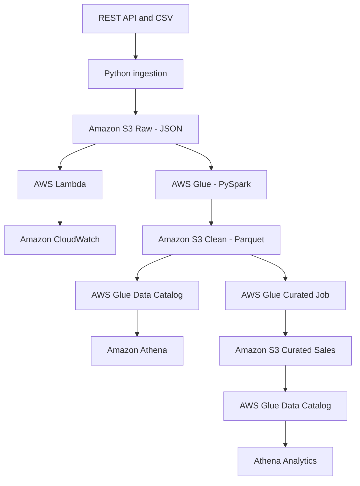

# AWS E-Commerce Data Platform

An end-to-end AWS data engineering project that ingests synthetic e-commerce data, processes it through raw, clean, and curated data layers, and makes it available for serverless analytics.

## Architecture



## Data Layers

| Layer | Format | Purpose |
|---|---|---|
| Raw | JSON | Preserves the original ingested API and CSV data |
| Clean | Parquet | Stores validated and standardized customers, orders, and products |
| Curated | Partitioned Parquet | Provides an analytics-ready sales dataset enriched with customer and product information |

The curated sales dataset is partitioned by `ingestion_date` to reduce the amount of data scanned by analytical queries.

## Implemented Workflow

1. Ingest synthetic customer, order, and product data using Python.
2. Upload the source data to the Amazon S3 raw layer.
3. Process S3 events with AWS Lambda and record monitoring information in CloudWatch.
4. Transform raw JSON data into clean Parquet datasets using AWS Glue and PySpark.
5. Discover clean datasets with AWS Glue Crawlers.
6. Validate clean tables using Amazon Athena.
7. Join orders, customers, and products into a curated sales dataset.
8. Write partitioned Parquet files to the S3 curated layer.
9. Register the curated dataset in the AWS Glue Data Catalog.
10. Run analytical SQL queries using Amazon Athena.

## Analytics Results

The completed pipeline produced:

- 788 curated sales line items
- 208 distinct orders
- 24 product categories
- Total net revenue of 3,447,183.80
- No duplicate order-product combinations in the validated curated dataset

Example business analyses include:

- Revenue and units sold by product category
- Top products by net revenue
- Top customers by revenue
- Validation of record counts and financial totals

## Technologies

- Python
- PySpark
- SQL
- Amazon S3
- AWS Lambda
- AWS Glue ETL
- AWS Glue Crawlers
- AWS Glue Data Catalog
- Amazon Athena
- Amazon CloudWatch
- AWS CLI
- Git and GitHub

## Project Structure

```text
.
├── architecture/
│ └── decisions/
├── data/
│ ├── raw/
│ ├── clean/
│ ├── curated/
│ └── sample/
├── docs/
├── infrastructure/
├── sql/
│ └── athena/
└── src/
├── glue/
├── ingestion/
├── lambda/
└── utils/
```

## SQL Analytics

Athena queries are stored in `sql/athena/`:

- `01_validate_clean_counts.sql`
- `02_top_customers_by_revenue.sql`
- `03_validate_curated_sales.sql`
- `04_revenue_by_category.sql`
- `05_top_products_by_revenue.sql`

## Reliability and Cost Controls

The project uses:

- Parquet columnar storage
- Date-based partitioning
- Data-quality validation
- CloudWatch logging
- Minimal Glue worker capacity
- Short Glue job timeouts
- On-demand Glue Crawlers
- Athena queries that scan only small Parquet datasets
- Environment variables for configuration
- No credentials or secrets committed to Git

## Project Status

The core end-to-end data pipeline is complete:

- [x] Data ingestion
- [x] S3 raw layer
- [x] Lambda monitoring
- [x] Raw-to-clean Glue transformation
- [x] Clean Glue Data Catalog
- [x] Athena clean-data validation
- [x] Clean-to-curated Glue transformation
- [x] Curated Glue Data Catalog
- [x] Athena business analytics
- [ ] Automated orchestration
- [ ] Infrastructure as Code
- [ ] BI dashboard
- [x] Automated tests